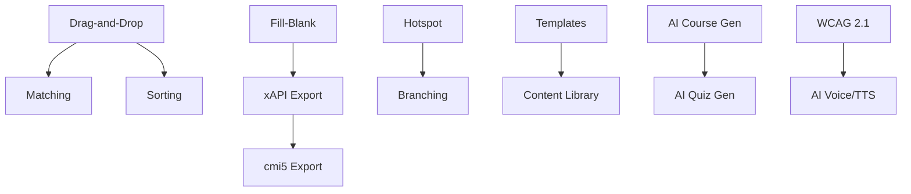

# Feature Roadmap — AccCourse

## Table of Contents
- [Visão Geral](#visão-geral)
- [Fase 1: Interatividade Core](#fase-1-interatividade-core)
- [Fase 2: Export & Standards](#fase-2-export--standards)
- [Fase 3: Enterprise Features](#fase-3-enterprise-features)
- [Fase 4: AI & Inovação](#fase-4-ai--inovação)
- [Priorização e Dependências](#priorização-e-dependências)

---

## Visão Geral

```
   FASE 1              FASE 2              FASE 3              FASE 4
┌──────────┐      ┌──────────┐      ┌──────────┐      ┌──────────┐
│ Interati-│      │ Export & │      │Enterprise│      │ AI &     │
│ vidade   │─────▸│ Standards│─────▸│ Features │─────▸│ Inovação │
│ Core     │      │          │      │          │      │          │
└──────────┘      └──────────┘      └──────────┘      └──────────┘
  6-8 sem            4-6 sem           8-12 sem           6-10 sem
```

---

## Fase 1: Interatividade Core

**Objetivo**: Completar os tipos de interação para igualar concorrentes básicos.

### F1.1 — Drag-and-Drop Block

| Campo | Valor |
|-------|-------|
| **Prioridade** | P0 (Crítico) |
| **Complexidade** | L (Large) |
| **Dependência** | @dnd-kit (já instalado) |
| **Estimativa** | 3-5 dias |

```typescript
interface DragDropBlock extends BaseBlock {
  type: "dragdrop";
  items: { id: string; content: string; correctZoneId: string }[];
  zones: { id: string; label: string; x: number; y: number; width: number; height: number }[];
  feedbackCorrect: string;
  feedbackIncorrect: string;
  pointsValue: number;
  allowPartialScore: boolean;
}
```

**Componentes impactados**: `useEditorStore.ts`, `DraggableBlock.tsx`, `PropertiesPanel.tsx`, `TopToolbar.tsx`, `htmlGenerator.ts`

**SCORM**: `cmi.interactions.n.type = "matching"`, registra cada item+zona como `student_response`

---

### F1.2 — Liga Pontos / Matching Block

| Campo | Valor |
|-------|-------|
| **Prioridade** | P0 |
| **Complexidade** | M (Medium) |
| **Estimativa** | 2-3 dias |

```typescript
interface MatchingBlock extends BaseBlock {
  type: "matching";
  pairs: { id: string; left: string; right: string }[];
  feedbackCorrect: string;
  feedbackIncorrect: string;
  pointsValue: number;
  shuffleRight: boolean;
}
```

**UI**: Coluna esquerda fixa, coluna direita embaralhada, linhas SVG conectando pares.

---

### F1.3 — Sorting / Ordenação Block

| Campo | Valor |
|-------|-------|
| **Prioridade** | P1 |
| **Complexidade** | M |
| **Dependência** | @dnd-kit/sortable (já instalado) |
| **Estimativa** | 2-3 dias |

```typescript
interface SortingBlock extends BaseBlock {
  type: "sorting";
  items: { id: string; content: string }[];
  correctOrder: string[];        // IDs na ordem correta
  feedbackCorrect: string;
  feedbackIncorrect: string;
  pointsValue: number;
}
```

**SCORM**: `cmi.interactions.n.type = "sequencing"`

---

### F1.4 — Preencher Lacunas (Fill-in-the-Blank)

| Campo | Valor |
|-------|-------|
| **Prioridade** | P1 |
| **Complexidade** | M |
| **Estimativa** | 2-3 dias |

```typescript
interface FillBlankBlock extends BaseBlock {
  type: "fillblank";
  segments: (
    | { type: "text"; content: string }
    | { type: "blank"; id: string; correctAnswer: string; acceptedVariants: string[] }
  )[];
  caseSensitive: boolean;
  feedbackCorrect: string;
  feedbackIncorrect: string;
  pointsValue: number;
}
```

**SCORM**: `cmi.interactions.n.type = "fill-in"`

---

### F1.5 — Hotspot Block

| Campo | Valor |
|-------|-------|
| **Prioridade** | P1 |
| **Complexidade** | M |
| **Estimativa** | 2-3 dias |

```typescript
interface HotspotBlock extends BaseBlock {
  type: "hotspot";
  imageSrc: string;
  spots: {
    id: string;
    x: number;           // % da imagem
    y: number;           // % da imagem
    radius: number;      // % da imagem
    label: string;
    content: string;     // HTML do tooltip/popup
    isCorrect?: boolean; // Para modo quiz
  }[];
  mode: "explore" | "quiz";     // Exploração livre ou quiz
  pointsValue: number;
}
```

---

### F1.6 — Accordion Block

| Campo | Valor |
|-------|-------|
| **Prioridade** | P2 |
| **Complexidade** | S (Small) |
| **Estimativa** | 1-2 dias |

```typescript
interface AccordionBlock extends BaseBlock {
  type: "accordion";
  sections: { id: string; title: string; content: string }[];
  allowMultipleOpen: boolean;
  style: "minimal" | "boxed" | "bordered";
}
```

---

### F1.7 — Tabs Block

| Campo | Valor |
|-------|-------|
| **Prioridade** | P2 |
| **Complexidade** | S |
| **Estimativa** | 1-2 dias |

```typescript
interface TabsBlock extends BaseBlock {
  type: "tabs";
  tabs: { id: string; label: string; content: string; icon?: string }[];
  orientation: "horizontal" | "vertical";
  style: "underline" | "boxed" | "pills";
}
```

---

### F1.8 — Timeline Block

| Campo | Valor |
|-------|-------|
| **Prioridade** | P2 |
| **Complexidade** | S |
| **Estimativa** | 1-2 dias |

```typescript
interface TimelineBlock extends BaseBlock {
  type: "timeline";
  events: { id: string; date: string; title: string; content: string; icon?: string }[];
  orientation: "horizontal" | "vertical";
  style: "dots" | "cards" | "alternating";
}
```

---

## Fase 2: Export & Standards

**Objetivo**: Ampliar os formatos de saída para compatibilidade com mais LMS.

### F2.1 — xAPI (Tin Can) Export

| Campo | Valor |
|-------|-------|
| **Prioridade** | P0 |
| **Complexidade** | L |
| **Estimativa** | 5-7 dias |

**Implementação**:
- Criar `src/lib/xapi/` análogo a `src/lib/scorm/`
- Gerar statements xAPI (experienced, completed, answered, scored)
- Implementar Activity Provider em JavaScript
- Endpoint de LRS ou config para LRS externo
- Arquivos: `xapiStatement.ts`, `xapiWrapper.ts`, `xapiPackager.ts`

---

### F2.2 — cmi5 Export

| Campo | Valor |
|-------|-------|
| **Prioridade** | P2 |
| **Complexidade** | M |
| **Dependência** | F2.1 (xAPI) — cmi5 é subset/profile de xAPI |
| **Estimativa** | 3-4 dias |

---

### F2.3 — HTML5 Standalone Export

| Campo | Valor |
|-------|-------|
| **Prioridade** | P1 |
| **Complexidade** | S |
| **Estimativa** | 2-3 dias |

**Implementação**: Reutilizar `htmlGenerator.ts`, remover SCORM adapter, gerar ZIP com HTML puro + assets.

---

### F2.4 — PDF Export

| Campo | Valor |
|-------|-------|
| **Prioridade** | P3 |
| **Complexidade** | M |
| **Estimativa** | 3-4 dias |

**Implementação**: Usar Puppeteer/Playwright server-side para renderizar slides como PDF.

---

## Fase 3: Enterprise Features

**Objetivo**: Features necessárias para adoção em grandes empresas.

### F3.1 — Template Library

| Campo | Valor |
|-------|-------|
| **Prioridade** | P0 |
| **Complexidade** | L |
| **Estimativa** | 5-7 dias |

- Criar model `Template` no Prisma (título, categoria, slideData JSON, thumbnail)
- UI de galeria com filtros (categoria, cor, estilo)
- Botão "Usar Template" que clona slides para novo projeto
- Templates iniciais: Onboarding, Compliance, Product Training, Soft Skills

### F3.2 — Content Library / Asset Manager

| Campo | Valor |
|-------|-------|
| **Prioridade** | P1 |
| **Complexidade** | XL |
| **Estimativa** | 8-12 dias |

- Biblioteca de imagens, ícones, vídeos reutilizáveis
- Upload em bulk, tagging, busca
- Integração com Unsplash/Pexels para stock gratuito
- Model `Asset` no Prisma (url, type, tags, tenantId)

### F3.3 — Colaboração em Tempo Real

| Campo | Valor |
|-------|-------|
| **Prioridade** | P2 |
| **Complexidade** | XL |
| **Estimativa** | 10-15 dias |

- WebSocket via Liveblocks ou Yjs
- Cursores multi-usuário no canvas
- Lock/unlock de blocos
- Histórico de alterações por usuário

### F3.4 — Analytics Dashboard

| Campo | Valor |
|-------|-------|
| **Prioridade** | P1 |
| **Complexidade** | L |
| **Estimativa** | 5-7 dias |

- Métricas: cursos criados, completion rate, quiz scores
- Gráficos com Recharts ou Chart.js
- Filtros por tenant, período, autor
- Export CSV/PDF

### F3.5 — Versionamento de Cursos

| Campo | Valor |
|-------|-------|
| **Prioridade** | P2 |
| **Complexidade** | M |
| **Estimativa** | 3-4 dias |

- Snapshot do courseData a cada publicação
- Diff visual entre versões
- Rollback para versão anterior

### F3.6 — RBAC Avançado

| Campo | Valor |
|-------|-------|
| **Prioridade** | P1 |
| **Complexidade** | M |
| **Estimativa** | 3-4 dias |

- Roles granulares: Admin, Editor, Reviewer, Viewer
- Permissões por curso (owner, collaborator)
- Middleware de autorização

---

## Fase 4: AI & Inovação

**Objetivo**: Diferenciação competitiva com features de ponta.

### F4.1 — AI Course Generator

| Campo | Valor |
|-------|-------|
| **Prioridade** | P0 |
| **Complexidade** | XL |
| **Estimativa** | 7-10 dias |

- Prompt → GPT-4o → CourseProject JSON completo
- "Crie um curso de compliance LGPD com 10 slides e 3 quizzes"
- Structured output via Zod schema
- Streaming para feedback em tempo real (Vercel AI SDK)

### F4.2 — AI Quiz Generator

| Campo | Valor |
|-------|-------|
| **Prioridade** | P0 |
| **Complexidade** | M |
| **Estimativa** | 2-3 dias |

- Seleciona conteúdo de texto → GPT-4o gera perguntas
- Tipos: múltipla escolha, V/F, fill-blank
- Nível de dificuldade configurável

### F4.3 — AI Voice / TTS

| Campo | Valor |
|-------|-------|
| **Prioridade** | P1 |
| **Complexidade** | L |
| **Estimativa** | 5-7 dias |

- OpenAI TTS ou ElevenLabs
- Narração por slide com texto das notas
- Preview no editor + embed no SCORM export
- Suporte multi-idioma

### F4.4 — Branching Scenarios

| Campo | Valor |
|-------|-------|
| **Prioridade** | P1 |
| **Complexidade** | XL |
| **Estimativa** | 8-12 dias |

```typescript
interface BranchingBlock extends BaseBlock {
  type: "branching";
  question: string;
  choices: {
    id: string;
    text: string;
    targetSlideId: string;    // Para onde vai
    feedback?: string;
  }[];
  style: "buttons" | "cards" | "visual";
}
```

- Editor visual de fluxo (mini node graph)
- SCORM: `cmi.suspend_data` para salvar caminho do aluno

### F4.5 — Gamificação

| Campo | Valor |
|-------|-------|
| **Prioridade** | P2 |
| **Complexidade** | L |
| **Estimativa** | 5-7 dias |

- Sistema de pontos (já existe por quiz, expandir)
- Badges por conclusão, score perfeito, velocidade
- Leaderboard por tenant
- Progress bar visual no curso

### F4.6 — WCAG 2.1 AA Compliance

| Campo | Valor |
|-------|-------|
| **Prioridade** | P0 |
| **Complexidade** | L |
| **Estimativa** | 5-7 dias |

- Alt text obrigatório para imagens (AI-assisted)
- Navegação por teclado completa
- Contraste mínimo 4.5:1
- Closed captions para vídeos/áudio
- ARIA landmarks no SCORM export
- Checker de acessibilidade integrado

### F4.7 — PowerPoint Import

| Campo | Valor |
|-------|-------|
| **Prioridade** | P2 |
| **Complexidade** | XL |
| **Estimativa** | 8-12 dias |

- Upload de .pptx → parse com pptx-parser ou python-pptx (via API)
- Converter slides em CourseProject (blocos de texto + imagem)
- Manter formatação básica (fontes, cores, posição)
- Botão "Adicionar interatividade" pós-import

---

## Priorização e Dependências



### Resumo de Prioridades

| Prioridade | Features |
|------------|----------|
| **P0** | Drag-and-drop, Matching, xAPI, Templates, AI Course Gen, AI Quiz Gen, WCAG 2.1 |
| **P1** | Sorting, Fill-blank, Hotspot, HTML5 Export, Content Library, Analytics, RBAC, AI Voice, Branching |
| **P2** | Accordion, Tabs, Timeline, cmi5, Colaboração, Versionamento, Gamificação, PPT Import |
| **P3** | PDF Export |
